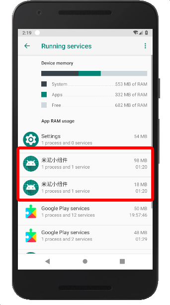
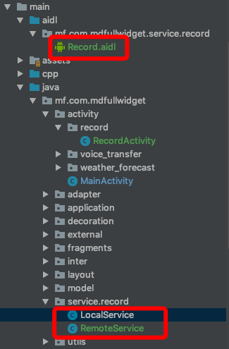
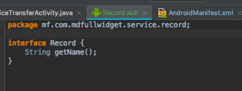
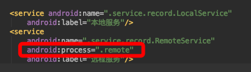
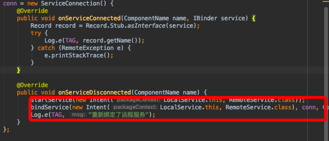

双进程守护需要通过一个进程保活另一个进程，当两个进程中其中一个被kill掉时，另一个会重启被kill掉的进程，从而保证子子孙孙无穷无尽。一个进程需要知道另一个进程的状态，需要实现进程间通信aidl。然后我们需要后台服务唤醒进程，同时可以在后台做一些悄悄的事情，系统又杀不死，于是被认为是流氓软件，像qq微信也是这样的。但是随着安卓版本提升，这种方式也开始失效了。当一个服务被系统杀死却重启多次后，他就真的死了（相当于在正在运行界面手中杀死他）。如果是意外被杀死非系统主动杀死而服务是sticky的话，系统反而会认为服务意外停止而重启他。
以往尝试让服务长时间存活在后台的方式是在一个进程里建立两个服务让他们相互监听，当其中一个服务被杀死时，另一个服务重新启动被杀死的服务。但是因为在同一个进程中，当进程被杀死，服务也终止，因为服务属于进程。这就为和双进程那么重要。
首先定义aidl文件，因为不需要具体交互数据，所以方法随便来一个就行。



aidl文件所在目录必须保证包名结构和对应服务报名目录结构一致。下面是aidl文件内容：




包名必须和所在目录包名一致，接口名称和定义的方法根据实际需求而定，这里没有要求。
下面是两个aidlservice：
```java
import android.app.Service;
import android.content.ComponentName;
import android.content.Context;
import android.content.Intent;
import android.content.ServiceConnection;
import android.os.IBinder;
import android.os.RemoteException;
import android.util.Log;

public class LocalService extends Service {

    final String TAG=this.getClass().getSimpleName();

    IBinder binder=new Record.Stub() {
        @Override
        public String getName() throws RemoteException {
            return TAG;
        }
    };

    @Override
    public IBinder onBind(Intent intent) {
        return binder;
    }

    ServiceConnection conn;

    @Override
    public void onCreate() {
        super.onCreate();
        if(conn==null) {
            conn = new ServiceConnection() {
                @Override
                public void onServiceConnected(ComponentName name, IBinder service) {
                    Record record = Record.Stub.asInterface(service);
                    try {
                        Log.e(TAG, record.getName());
                    } catch (RemoteException e) {
                        e.printStackTrace();
                    }
                }

                @Override
                public void onServiceDisconnected(ComponentName name) {
                    startService(new Intent(LocalService.this, RemoteService.class));
                    bindService(new Intent(LocalService.this, RemoteService.class), conn, Context.BIND_IMPORTANT);
                    Log.e(TAG, "重新绑定了远程服务");
                }
            };
        }
    }

    @Override
    public int onStartCommand(Intent intent, int flags, int startId) {
        LocalService.this.bindService(new Intent(LocalService.this, RemoteService.class), conn, Context.BIND_IMPORTANT);
        Log.e(TAG,"本地服务绑定了远程服务");
        return START_STICKY;
    }

    @Override
    public void onDestroy() {
        super.onDestroy();
        unbindService(conn);
    }
}
```
```java

import android.app.Service;
import android.content.ComponentName;
import android.content.Context;
import android.content.Intent;
import android.content.ServiceConnection;
import android.os.IBinder;
import android.os.RemoteException;
import android.util.Log;

public class RemoteService extends Service {

    final String TAG=this.getClass().getSimpleName();

    IBinder binder=new Record.Stub() {
        @Override
        public String getName() throws RemoteException {
            return TAG;
        }
    };

    @Override
    public IBinder onBind(Intent intent) {
        return binder;
    }

    ServiceConnection conn;

    @Override
    public void onCreate() {
        super.onCreate();
        if(conn==null){
            conn=new ServiceConnection() {
                @Override
                public void onServiceConnected(ComponentName name, IBinder service) {
                    Record record=Record.Stub.asInterface(service);
                    try {
                        Log.e(TAG,record.getName());
                    } catch (RemoteException e) {
                        e.printStackTrace();
                    }
                }

                @Override
                public void onServiceDisconnected(ComponentName name) {
                    startService(new Intent(RemoteService.this,LocalService.class));
                    bindService(new Intent(RemoteService.this,LocalService.class),conn,Context.BIND_IMPORTANT);
                    Log.e(TAG,"重新绑定了本地服务");
                }
            };
        }
    }

    @Override
    public int onStartCommand(Intent intent, int flags, int startId) {
        RemoteService.this.bindService(new Intent(RemoteService.this, LocalService.class), conn, Context.BIND_IMPORTANT);
        Log.e(TAG,"远程服务绑定本地服务");
        return START_STICKY;
    }

    @Override
    public void onDestroy() {
        super.onDestroy();
        unbindService(conn);
    }
}
```
他们基本上是一样的，功能只是在对方被kill掉时启动对方。重点是这两个service必须在不同进程中，所以需要在配置中指定其中一个service独立的process，名称随意。



这样就拥有两个进程了。并且通过了aidl进行进程间通信，可以监听到另一个服务的终止，比如上面某个服务中的：



从服务连接中可以在另一个服务被kill时启动他，并绑定他。
因为在启动对方的时候对方会对当前服务进行绑定，所以这里只需要再次调用本身绑定对方，形成闭环，子子孙孙无穷无尽。
理论上这种方式可以让服务永留后台，但是实际上多次在正在运行任务界面杀死多次后就再也无法起来了。有可能高版本的api已经禁止了这种流氓行为。也有可能只是因为频繁关闭服务导致其中一个服务还没启动就关闭了另一个服务，所以就没有服务拉起了。但也有可能是我手速太快，系统卡顿造成服务没有绑定好另一个服务，就被我再次kill了。或者服务还没有重启完全就被kill，因为用到aidl，aidl比较耗时。
qq微信也是用的双进程甚至多进程，但是主要是大厂对安卓系统做了定制，预制应用有安卓系统保活，后台服务杀不死是合法的流氓行为。
但是网上还可以找到比较零散的方式对后台服务进行保活。
1.在服务的onStartCommand返回sticky标签，这个当服务被意外kill时系统会重启他，但是进程被kill服务自然被kill，用处不大。
```java
@Override  
public int onStartCommand(Intent intent, int flags, int startId) {  
    flags = START_STICKY;  
    return super.onStartCommand(intent, flags, startId);  
}  
```
3.当服务处于一些回调状态比如onStartCommand和onDestroy等时会处于前台，处于前台的服务更不容易被kill
在onStartCommand回调中将服务放到前台
```java
Notification notification = new Notification(R.drawable.ic_launcher,  
 getString(R.string.app_name), System.currentTimeMillis());  
   PendingIntent pendingintent = PendingIntent.getActivity(this, 0,  
 new Intent(this, AppMain.class), 0);  
 notification.setLatestEventInfo(this, "uploadservice", "请保持程序在后台运行",  
 pendingintent);  
startForeground(0x111, notification);
```
在onDestroy时取消前台
```java
stopForeground(true)
```
这个方法比较有效，但是还是有可能被kill

4.通过广播重新启动服务
定义一个receiver
```java
public class BootReceiver extends BroadcastReceiver {  
    @Override  
    public void onReceive(Context context, Intent intent) {  
        if (intent.getAction().equals("action")) {  
            //TODO  
            //在这里写重新启动service的相关操作  
                startMyService(context);  
        }  
    }  
  }  
  ```
在receiver的配置下定义一个action
```java
<action android:name="action" />
```
在onDestroy时发送广播，重启service
```java
 Intent intent = new Intent("action");  
 sendBroadcast(intent);  
```
5.application设置persistent属性

6.监听手机状态的广播，在receiver中多添加系统状态的action
```java
<action android:name="android.intent.action.BOOT_COMPLETED" />  
  <action android:name="android.intent.action.USER_PRESENT" />  
  <action android:name="android.intent.action.PACKAGE_RESTARTED" />  
```
7.系统应用优先级最高，把apk放到system/app目录下，需要root

